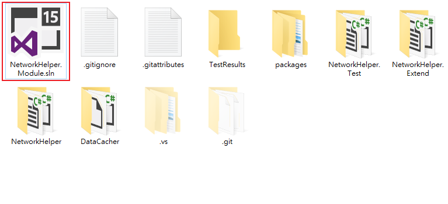
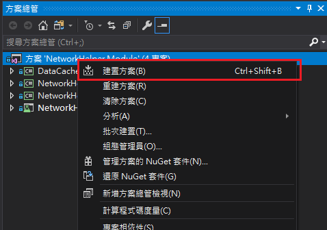
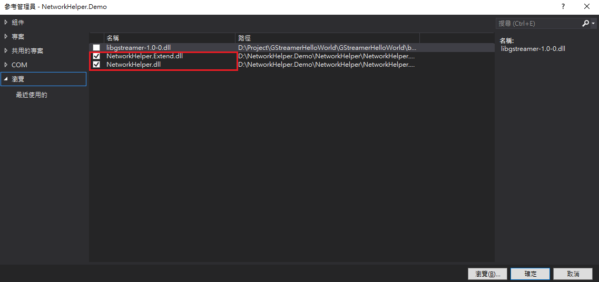

# NetworkHelper.Extend
## Introduction
`NetworkHelper.Extend`(以下稱為`Extend`)為`NetworkHelper`的延伸套件；`Extend`主要實現`NetworkHelper`讓使用者以Method-Chaining的風格撰寫程式。
## Purpose
`NetworkHelper`以`Connecter`物件為介面，提供`Get`、`Post`、`Put`、`Delete`等功能，讓使用者方便地以各種HTTP協定功能連接Api，同時也提供Deleget型態的參數，方便使用者設定各項功能連線失敗時要執行的動作。而`Extend`則是針對"設定連線失敗時要執行的動作"進行改良；`Extend`主要簡化了`Connecter`各項功能所需傳入的參數，並且提供`IfSuccess`、`IfFailure`、以及`IfTimeOut`等功能，讓使用者以Method-Chaining的風格設定連線成功或失敗所要進行的動作。
## Environment & Installation
適用語言：C#  
適用框架：.Net Framework 4.6.1 以上(含)  
建議開發工具：Visual Studio 2015 以上(含)  
源碼位置：https://github.com/allen8673/NetworkHelper.git  
安裝說明：  
- 1 打開`NetworkHelper.Module.sln`進行編譯

- 2 將`NetworkHelper`編譯完成內容(通常在該專案資料夾中`bin`資料夾底下)加入至目標方案中
- 3 開啟目標方案，將`NetworkHelper.dll`以及`NetworkHelper.Extend.dll`加入至指定專案即可

## Methods

`Extend`以`Promise`物件為介面提供與`Connecter`同的各項功能，