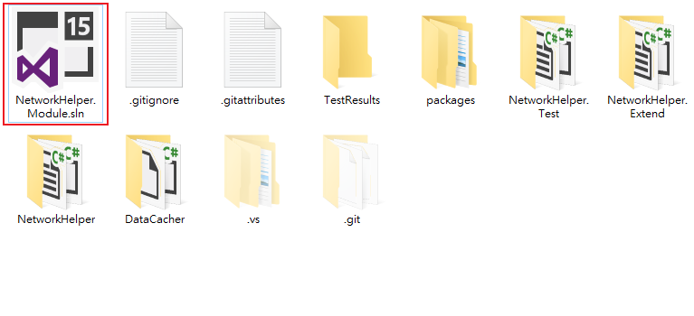
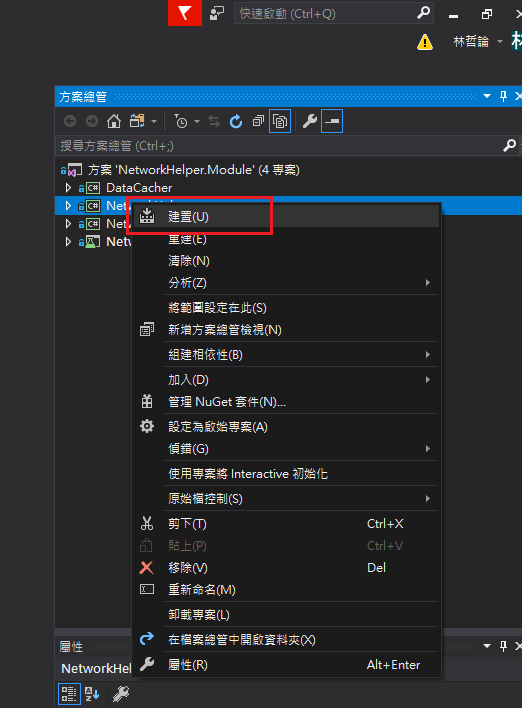
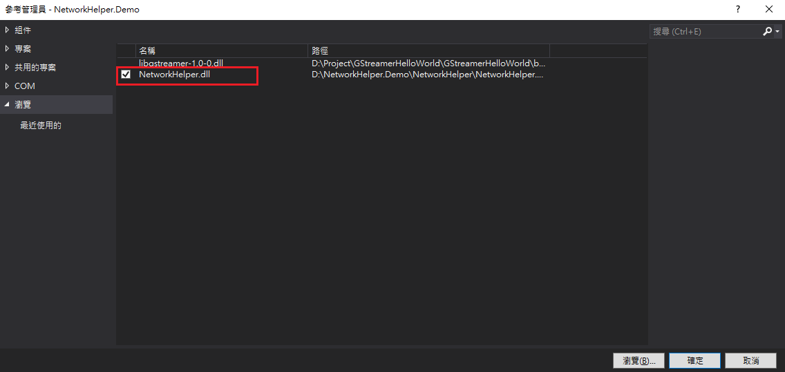

# NetworkHelper

## Introduction
NetworkHelp以C#整合`dotNet HttpClient`，以及套件`Newtonsoft.Json`，讓使用者得以方便地使用Http `Post`,`Get`,`Put`,`Delete`等方法與Api連線，並且將其回應的Json轉成指定型別的物件。

## Purpose
雖然`dotNet HttpClient`可以透過Http `Post`,`Get`,`Put`,`Delete`方法連接Web api，但是使用上卻相對複雜，其常見標準程式範例如下：

```csharp
using(HttpClient client = new HttpClient())
{
    try	
    {
        HttpResponseMessage response = await client.GetAsync("http://www.contoso.com/");
        response.EnsureSuccessStatusCode();
        string responseBody = await response.Content.ReadAsStringAsync();
        List<Model> model = JsonConvert.DeserializeObject<List<Model>>(responseBody);
      }  
      catch(HttpRequestException e)
      {
         Console.WriteLine("Exception Caught!");	
         Console.WriteLine("Message :{0} ",e.Message);
      }
}
```

為了簡化上述程式，讓使用者可以更方便的處理Api的連接，以及將`Json Object`轉換為指定型態的物件，因此提出`NetworkHelp`，整合`dotNet HttpClient`以及套件`Newtonsoft.Json`，並將其簡化為簡單的方法供使用者使用，以簡潔程式，避免過多冗長的程式重複出現而造成系統難以維護。

## Environment & Installation
適用語言：C#  
適用框架：.Net Framework 4.6.1 以上(含)  
建議開發工具：Visual Studio 2015 以上(含)  
源碼位置：https://github.com/allen8673/NetworkHelper.git  
安裝說明：
- 1 打開`NetworkHelper.Module.sln`進行編譯



- 2 將`NetworkHelper`編譯完成內容(通常在該專案資料夾中`bin`資料夾底下)加入至目標方案中
- 3 開啟目標方案，將`NetworkHelper.dll`加入至指定專案即可


## Methods

`NetworkHelper`主要以`Connecter`物件作為功能介面。其中提供方法如下表:

|方法|說明|參數說明|
|:-|:-|:-|
|Get|以Http Get連接Api，並取得資訊|baseUri: Host url網址<br> api: Api相對網址(不含Host url)<br> failureAct: 指定錯誤發生時所要執行的動作<br> jPath: 傳入JSON Property, JSON Object將由指定的Property反序列化為物件<br>|
|Post|以Http Post連接Api，並傳送內容以取得資訊|baseUri: Host url網址<br> api: Api相對網址(不含Host url)<br> mediaType: 傳送資訊型態(xaml, jason等....)<br> requestHeader:傳送時Header的內容 <br/> failureAct: 指定錯誤發生時所要執行的動作<br> jPath: 傳入JSON Property, JSON Object將由指定的Property反序列化為物件<br>|
|PostJson|以Http Post連接Api，並以Json傳送內容以取得資訊|baseUri: Host url網址<br> api: Api相對網址(不含Host url)<br>request: 任意傳送內容<br> failureAct: 指定錯誤發生時所要執行的動作<br> jPath: 傳入JSON Property, JSON Object將由指定的Property反序列化為物件<br>|
|Put|以Http Put連接Api，並傳送內容以取得內容|api: Api相對網址(不含Host url)<br>request: 任意傳送內容<br> failureAct: 指定錯誤發生時所要執行的動作<br> jPath: 傳入JSON Property, JSON Object將由指定的Property反序列化為物件<br>|
|Delete|以Http Delete連接Api，並且傳送內容|api: Api相對網址(不含Host url)<br> jPath: 傳入JSON Property, JSON Object將由指定的Property反序列化為物件<br>|
|Upload|以Http Post上傳檔案|api: Api相對網址(不含Host url)<br> files:上傳檔案資訊<br> data: 傳送內容<br>failureAct: 指定錯誤發生時所要執行的動作<br> jPath: 傳入JSON Property, JSON Object將由指定的Property反序列化為物件<br>|
|Download| 下載檔案| downloadSetting: 下載檔案設定|

## Sample
+ Connecter設定Base url
```csharp
Connecter.SetBaseUri(new Uri("your host url"));
```
+ Connecter設定Token
```csharp
Connecter.SetToken("your token");
```

+ Connecter.Get

Sample 1：傳入`Api Url`參數至`Get`方法，取得Json object，並將其轉為指定型態物件
```csharp
Model model = await Connecter.Get<Model>("Sample/GetDemo");
```
Sample 2：進一步將失敗時所需要執行的動作傳入至`Get`方法
```csharp
Model model = await Connecter.Get<Model>("Sample/GetDemo", (resp)=>
{
    Console.WriteLine(resp.StatusCode);
    return new model;
});
```

+ Connecter.Post

Sample 1：傳入`Api Url`參數至`Post`方法，取得Json object，並將其轉為指定型態物件
```csharp
Model model = await Connecter.Post<Model>("Sample/PostDemo",
                new MediaTypeWithQualityHeaderValue("application/json"), 
                new RequestHeader { token = "your token" },
                new StringContent("json object content"));
```
Sample 2：進一步將失敗時所需要執行的動作傳入至`Post`方法
```csharp
Model model = await Connecter.Post<Model>("Sample/PostDemo",
                new MediaTypeWithQualityHeaderValue("application/json"), 
                new RequestHeader { token = "your token" },
                new StringContent("json object content"),
                (resp)=> 
                {
                    Console.WriteLine(resp.StatusCode);
                    return new Model();
                });
```

+ Connecter.PostJson

Sample 1：傳入`Api Url`參數至`PostJson`方法，取得Json object，並將其轉為指定型態物件
```csharp
Model model = await Connecter.PostJson<Model>("Sample/PostJsonDemo",
new
{
    Property_1 = 1,
    Property_2 = "demo"
});
```
Sample 2：進一步將失敗時所需要執行的動作傳入至`PostJson`方法
```csharp
Model model = await Connecter.PostJson<Model>("Sample/PostJsonDemo", 
new
{
    Property_1 = 1,
    Property_2 = "demo"
}, (resp) =>
{
    Console.WriteLine(resp.StatusCode);
    return new Model();
});
```

+ Connecter.Put

Sample 1：傳入`Api Url`參數至`Put`方法，取得Json object，並將其轉為指定型態物件
```csharp
Model model = await Connecter.Put<Model>("Sample/PutDemo", 
new
{
    Property_1 = 1,
    Property_2 = "demo"
});
```
Sample 2：進一步將失敗時所需要執行的動作傳入至`Put`方法
```csharp
Model model = await Connecter.Put<Model>("Sample/PutDemo", 
new
{
    Property_1 = 1,
    Property_2 = "demo"
}, (resp) =>
{
    Console.WriteLine(resp.StatusCode);
    return new Model();
});
```

+ Connecter.Delete

Sample 1：傳入`Api Url`參數至`Delete`方法，取得Json object，並將其轉為指定型態物件
```csharp
Model model = await Connecter.Delete<Model>("Sample/DeleteDemo");
```
Sample 2：進一步將失敗時所需要執行的動作傳入至`Delete`方法
```csharp
Model model = await Connecter.Delete<Model>("Sample/DeleteDemo", (resp) =>
{
    Console.WriteLine(resp.StatusCode);
    return new Model();
});
```

+ Connecter.Upload

Sample 1：傳入`Api Url`參數，以及一個或數個檔案資訊`FileInfo`，至`Upload`方法，取得Json object，並將其轉為指定型態物件
```csharp
IEnumerable<FileInfo> files = new FileInfo[]
{
    new FileInfo { FileName = "file1.doc", Path ="file1 path" },
    new FileInfo { FileName = "file2.doc", Path ="file2 path" }
};

Model model = await Connecter.Upload<Model>("Sample/UploadDemo", files);
```
Sample 2：將額外資訊傳入至`Upload`方法，令其一併傳至Api
```csharp
IEnumerable<FileInfo> files = new FileInfo[]
{
    new FileInfo { FileName = "file1.doc", Path ="file1 path" },
    new FileInfo { FileName = "file2.doc", Path ="file2 path" }
};

Model model = await Connecter.Upload<Model>("Sample/UploadDemo", files, 
new 
{
    Property_1 = 1,
    Property_2 = "demo"
});
```
Sample 3：進一步將失敗時所需要執行的動作傳入至`Upload`方法
```csharp
IEnumerable<FileInfo> files = new FileInfo[]
{
    new FileInfo { FileName = "file1.doc", Path ="file1 path" },
    new FileInfo { FileName = "file2.doc", Path ="file2 path" }
};

Model model = await Connecter.Upload<Model>("Sample/UploadDemo", files, 
new 
{
    Property_1 = 1,
    Property_2 = "demo"
}, (resp) =>
{
    Console.WriteLine(resp.StatusCode);
    return new Model();
});
```

+ Connecter.Download
```csharp
await Connecter.Download(new DownloadSetting
{
    DownloadUri = new System.Uri("your download rul"),
    DownloadPath = "your download path"
});
```


## About Parameter `jPath` 

於 [Methods](#methods)中說明部分方法可以傳入參數`jPath`，並且說明`jPath`為指定的JSON Property，可以令JSON Object將由指定的Property反序列化為物件。以下說明。
```json
{
    ID:'123',
    Data:
    {
        UUID:'XXXX-XXXXX-XXXXX',
        Info:
        {
            Name:'Person',
            Age:26,
            Phone:'0912-345-678',
            ...
        },        
        ...
    }
}
```
假設Api回傳的JSON Object如上，但是Client端所需要的Model結構如下:
```csharp
class Model
{
    public string Name { get; set; }
    public int Age { get; set; }
    public string Phone { get; set; }
    ...
}
```
如上述情境，使用者可以參數`jPath`指定JSON Object可以從Property `Info`反序列化，以取得所需要的資料。
